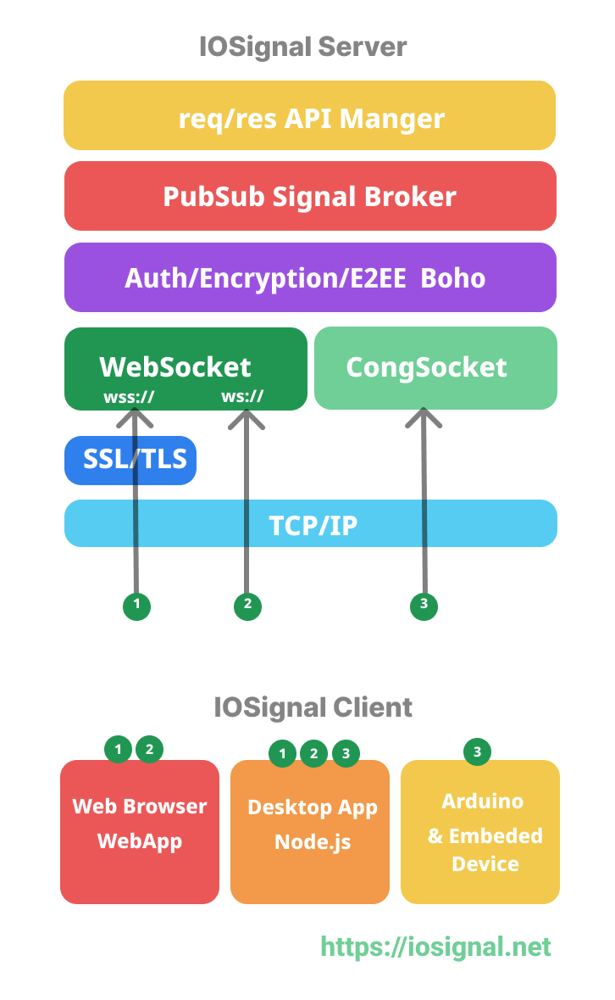

[ English | [한국어](README.ko.md) ]

# IOSignal

IOSignal enables real-time communication across web browsers, Node.js, and Arduino. It features built-in secure authentication, encrypted communication, and a pre-configured signaling protocol, allowing server deployment without complex programming.

## Install

```shell
$ npm i iosignal
```


## IOSignal Client


### React Client Example

A sample React project is available in `examples/react-chat-js`. This example demonstrates how to integrate `iosignal` into a React application for real-time chat functionality.

**Key Concepts:**

-   **`useRef`**: To maintain a stable reference to the `io` instance across component re-renders.
-   **`useEffect`**: To manage the lifecycle of the `io` instance, including initialization and cleanup. Event handlers are set up within this hook.
- To release the `io` instance when the component unmounts, use `io.destroy()`. Event handlers registered during mount are also automatically removed.

**To run the example:**

1.  Navigate to the server directory and start the server:
    ```shell
    cd examples/server
    npm install
    node .
    ```
2.  In a new terminal, navigate to the React project directory, install dependencies, and start the development server:
    ```shell
    cd examples/react-chat-js
    npm install
    npm run dev
    ```

**Example Code (`App.jsx`):**

If you open multiple browsers and enter a message, it will be delivered to each other via the server.

```javascript
import { useState, useEffect, useRef } from 'react';
import './App.css';
import IO from 'iosignal/io.js';

const url = 'ws://localhost:7777';
const channel_tag = 'channel#topic';

function App() {
  const [messages, setMessages] = useState([]);
  const [input, setInput] = useState('Hello, World!');
  const [ioState, setIoState] = useState(null);
  const [cid, setCid] = useState(null);
  const [counts, setCounts] = useState({ instances: 0, websockets: 0 });
  const ioRef = useRef(null);
  const messagesEndRef = useRef(null);

  const scrollToBottom = () => {
    messagesEndRef.current?.scrollIntoView({ behavior: "smooth" });
  };

  useEffect(() => {
    scrollToBottom();
  }, [messages]);

  useEffect(() => {
    ioRef.current = new IO(url);
    setCounts({ instances: IO.instanceCount, websockets: IO.webSocketCount });

    const handleReady = () => {
      console.log('ready cid:', ioRef.current.cid);
      setCid(ioRef.current.cid);
      ioRef.current.subscribe(channel_tag);
    };

    const handleChange = (state) => {
      setIoState(state);
      setCounts({ instances: IO.instanceCount, websockets: IO.webSocketCount });
    };

    const handleChannelMessage = (msgObj, tag) => {
      console.log('Received message in App:', msgObj, tag);
      if (typeof msgObj === 'string') {
        msgObj = { text: msgObj, cid: 'cli unknown' };
      }
      setMessages((prevMessages) => [...prevMessages, `${msgObj.cid} : ${msgObj.text}`]);
    };

    const handleError = (error) => {
      console.error('IO Error in App:', error);
      setIoState(`Error: ${error.message}`);
    };

    ioRef.current.on('ready', handleReady);
    ioRef.current.on('change', handleChange);
    ioRef.current.on(channel_tag, handleChannelMessage);
    ioRef.current.on('error', handleError);

    return () => {
      ioRef.current.destroy();
      console.log('IO instance destroyed.');
      ioRef.current = null;
    };
  }, []);

  const sendMessage = () => {
    if (input.trim()) {
      const msgObj = { text: input, cid: ioRef.current.cid };
      ioRef.current.signal(channel_tag, msgObj);
      setInput('date' + Date.now());
    }
  };

  const ioStateStyle = {
    color: ioState === 'ready' ? 'green' : 'red',
    fontWeight: 'bold',
  };

  return (
    <div className="App">
      <h1>React Chat Example</h1>
      <div>URL: {url}</div>
      <div>Channel: {channel_tag}</div>
      <div>IO State: <span style={ioStateStyle}>{ioState}</span></div>
      <div>Client ID: {cid}</div>
      <div>IO Instances: {counts.instances}</div>
      <div>WebSockets Created: {counts.websockets}</div>
      <div className="messages">
        {messages.map((msg, index) => (
          <div key={index}>{msg}</div>
        ))}
        <div ref={messagesEndRef} />
      </div>
      <div className="input-area">
        <input
          type="text"
          value={input}
          onChange={(e) => setInput(e.target.value)}
          onKeyUp={(e) => e.key === 'Enter' && sendMessage()}
          disabled={ioState !== 'ready'}
        />
        <button onClick={sendMessage} disabled={ioState !== 'ready'}>
          Send
        </button>
      </div>
    </div>
  );
}

export default App;
```


### Browser client : ESM

- local file: "dist/io.js"
- CDN: https://cdn.jsdelivr.net/npm/iosignal/dist/io.js

```html
<html>

  <script type="module">
    import IO from "../dist/io.js"

    const io = new IO('wss://io.iosignal.net/ws')
    io.listen('channel#topic', (...args)={
      console.log( args )
    })

    io.on('ready',()=>{
      console.log('ready cid:', io.cid )
    })

  </script>

</html>
```


### Browser Client : UMD(IIFE)
- local file: "dist/io.min.js"
- CDN: https://cdn.jsdelivr.net/npm/iosignal/dist/io.min.js

```html
<html>
  <script src="../dist/io.min.js"></script>
  <script>
    console.log('IO', IO)  // default global variable name is IO

    var io1 = new IO('ws://localhost:7777')
    var io2 = new IO('ws://localhost:7777')
    var io3 = new IO('ws://localhost:7777')

    io1.on('error', errorHandler )
    io2.on('error', errorHandler )
    io3.on('error', errorHandler )

    let channelName = 'io'

    // classic style subsribing
    io1.on('ready',e=>{
      io1.subscribe(channelName)
      io1.on(channelName, (...args)=>{
        // console.log('io1 received', args )
        let msg = '[io1] ' + JSON.stringify( args )
        addMessage(msg)
      })
    })

    // iosignal style subscribing
    io2.listen(channelName, (...args)=>{
      // console.log('io2 receive', args )
      let msg = '[io2] ' + JSON.stringify( args )
        addMessage(msg)
    })

    setInterval(e=>{
      io3.signal(channelName, 'single string')   // single string payload
      io3.signal(channelName, Date.now(), 'a', 2 , {key: 3} ) //multiple payload 
      io3.signal(channelName ) // pure signal without payload.
    },3000)

    function addMessage(msg){
      // ...
    }

    function errorHandler(e){
      // ...
    }
  </script>

</html>
```


### NodeJS Client
```js
  import { IO } from "iosignal"

  const io = new IO('wss://io.iosignal.net/ws')

  io.on('ready', ()=>{
    console.log('ready cid:', io.cid)
    io.signal('#screen','playToggle')
  });

  io.listen('#notify', (...args)=>{
    console.log( args )
  })

  io.on('error',err=>{
      console.log('err', err)
  })

```


## IOSignal Server


```js
import { Server } from "iosignal"

const server = new Server(
  {
    port: 7777,     
    congPort: 8888, 
    showMetric: 2,  
    showMessage: 'message' // show signal message
  })

```

- port: <Number> IOSignal over WebSocket
- congPort: <Number> IOsignal over CongSocket
- showMetric: 1|2|3 show clients cid(state) info
- showMessage: "none"|"message" show signal buffer message
- timeout <milliseconds> ping period & timeout (min. 1000)

### IOSignal API

IOSignal API examples
- src/api_reply.js  // 'echo', 'date', 'unixtime'
- src/api_sudo.js   // server admin monitoring command
- src/RedisAPI.js   // redis command and response service


To register an API service with the server, use the api() method

`api('api_name', module )`

```js
// node.js
import { Server ,api_reply  } from 'iosignal'
const server = new Server( { port: 7777 }  )
server.api('reply', api_reply) // attach api module
```

Example of a client calling the reply API

```js
  // web browser api client example
  <script src="../dist/io.min.js"></script>
  <script>
      const io = new IO('ws://localhost:7777')

      io.on('ready', async ()=>{
        let res_echo = await io.req('reply', 'echo', 'hello' )
        let res_date = await io.req('reply', 'date' )
        let res_unixtime = await io.req('reply', 'unixtime' )

        if( res_echo.ok ) console.log( res_echo.body  )
        if( res_date.ok ) console.log( res_date.body  )
        if( res_unixtime.ok ) console.log( res_unixtime.body  )
      });
  </script>

// result
[ 'hello' ]
Fri, 09 Feb 2024 14:24:37 GMT
1707488677

```


## Features

### Built-in Message Trasport Protocol
- pub/sub multicast by channel name.
- uni-cast: one to one messaging by CID.
- `CID` is a Communication Id
- CID subscribing: subscribe one peer using CID.
- HomeChannel: group by IP address.

### Built-in Security
- Authentication
- Encryption
- E2EE
- thanks to the `Boho` [ [github](https://github.com/remocons/boho) ]

## Connection
 - Web browser use WebSocket.
 - Node.js use WebSocket or CongSocket.
 - Arduino use CongSocket.

## IOSignal Server Architecture


## IOSignal repositories.

- Javascript: `iosignal` [ [github](https://github.com/remocons/iosignal) | [npm](https://www.npmjs.com/package/iosignal) ]
    - Node.js server ( WebSocket, CongSocket)
    - Node.js client ( WebSocket, CongSocket)
    - Web Browser client( WebSocket)

- CLI program
    - `iosignal-cli` [ [github](https://github.com/remocons/iosignal-cli) | [npm](https://www.npmjs.com/package/iosignal-cli) ]
    - install: `npm i -g iosignal-cli` or `sudo npm i -g iosignal-cli`
    - support mac, linux and windows.
    - server and client

- Arduino iosignal library and examples:
    - use Arduino Library Manager: `iosignal`
    - or `iosignal-arduino` [ [github](https://github.com/remocons/iosignal-arduino) ]
    - web app : http://test.iosignal.net

- Arduino remocon library and examples:
    - use Arduino Library Manager: `remocon`
    - or `remocon-arduino` [ [github](https://github.com/remocons/remocon-arduino) ]
    - web app : https://remocon.kr
    
## License

This code is released under the MIT License.