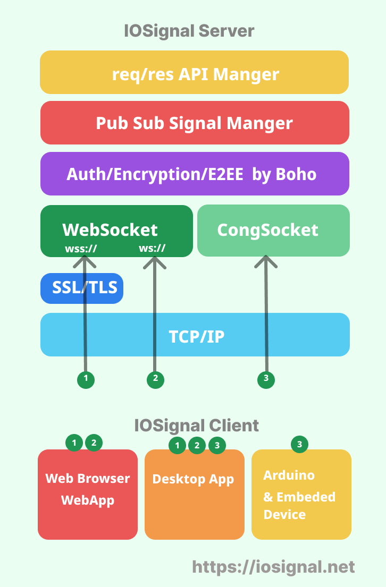

# IOSignal

This library provides a server and client for doing signaling(messaging) with peers that supports [`iosignal`](https://github.com/remocons/iosignal).

## Install

```
$ npm i iosignal
```

## Usage

NodeJS Server
```
// ESM  filename.mjs  
import { Server, ServerOption } from "iosignal"

// CJS  filename.cjs
// let { Server, serverOption } = require('iosignal')

serverOption.showMetric = 2;
serverOption.port = 7777  // websocket port for browser and nodejs app.
serverOption.congPort = 8888  // additional TCP port for Arduino
const server = new Server( serverOption )
console.log( 'serverOption:', serverOption )

```

NodeJS Client example
```
// ESM
import { IO } from "iosignal"

// CJS
// const { IO } = require('iosignal')

const io = new IO('wss://io.remocon.kr/ws')

io.on('ready', ()=>{
  console.log('ready cid:', io.cid)
  io.signal('#screen','playToggle')
});

io.listen('#notify', (...args)=>{
  console.log( args )
})

io.on('error',err=>{
    console.log('err', err)
})


```

IIFE: WebBrowser client
```
<html>
...
<script src="../dist/iosignal.min.js"></script>
...
  <script>
    console.log('IO', IO)  // default global variable name is capital IO

    var io1 = new IO('ws://localhost:7777')
    var io2 = new IO('ws://localhost:7777')
    var io3 = new IO('ws://localhost:7777')

    io1.on('error', errorHandler )
    io2.on('error', errorHandler )
    io3.on('error', errorHandler )

    let channelName = 'io'

    // classic style subsribing
    io1.on('ready',e=>{
      io1.subscribe(channelName)
      io1.on(channelName, (...args)=>{
        // console.log('io1 received', args )
        let msg = '[io1] ' + JSON.stringify( args )
        addMessage(msg)
      })
    })

    // iosignal style subscribing
    io2.listen(channelName, (...args)=>{
      // console.log('io2 receive', args )
      let msg = '[io2] ' + JSON.stringify( args )
        addMessage(msg)
    })

    setInterval(e=>{
      io3.signal(channelName, 'single string')   // single string payload
      io3.signal(channelName, Date.now(), 'a', 2 , {key: 3} ) //multiple payload 
      io3.signal(channelName ) // pure signal without payload.
    },3000)

    function addMessage(msg){
      // ...
    }

    function errorHandler(e){
      // ...
    }
  </script>

</html>
```

ESM: WebBrowser client
```
<html>
  ...
  <script type="module">
    import { IO, Boho, MBP, Buffer, sha256  } from "../dist/iosignal.esm.js"

    console.log('sha256.hash("hi")',  sha256.hash('hi'))    

    const = io = new IO('wss://io.remocon.kr/ws')
    io.listen('target#topic', (...args)={
      console.log( args )
    })

    io.on('ready',()=>{
      console.log('ready cid:', io.cid )
    })

  </script>
  ...
</html>
```
## Features

### Built-in Message Trasport Protocol
- pub/sub multicast by channel name.
- uni-cast: one to one messaging by CID.
- `CID` is a Communication Id
- CID subscribing: subscribe one peer using CID.
- HomeChannel: group by IP address.

### Built-in Security
- Authentication
- Encryption
- E2EE
- thanks to the `Boho` [ [github](https://github.com/remocons/boho) ]

## Connection
 - Web browser use WebSocket.
 - Node.js use WebSocket or CongSocket.
 - Arduino use CongSocket.



## iosignal repositories.
- Javascript: `iosignal` [ [github](https://github.com/remocons/iosignal) | [npm](https://www.npmjs.com/package/iosignal) ]
  - Node.js server ( WebSocket, CongSocket)
  - Node.js client ( WebSocket, CongSocket)
  - Web Browser client( WebSocket)
  
- Arduino client: 
  - Arduino Library Manager: `IOSignal`
  - or `iosignal-arduino` [ [github](https://github.com/remocons/iosignal-arduino) ]

- IOSignal CLI program 
  - server and client
  - support mac, linux and windows.
  - `iosignal-cli` [ [github](https://github.com/remocons/iosignal-cli) | [npm](https://www.npmjs.com/package/iosignal-cli) ]
  - install: `sudo npm i -g iosignal-cli` or  `npm i -g iosignal-cli`  

## License

This code is released under the MIT License.