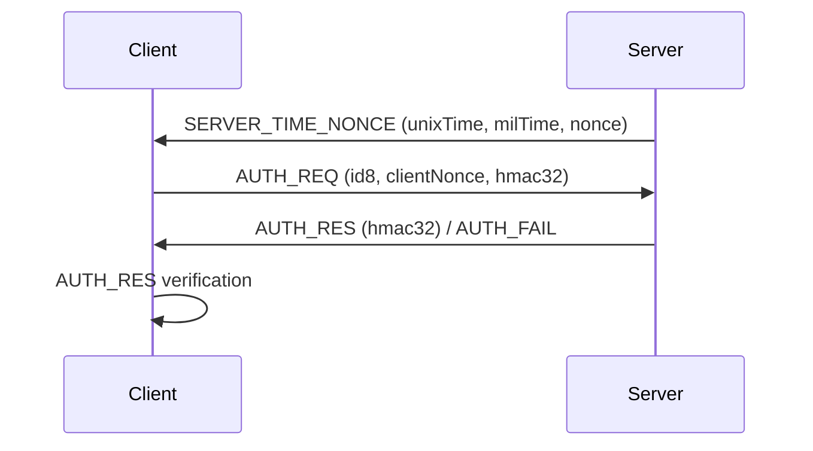

# Boho

**Node.js, 브라우저, Arduino를 위한 안전하고 가벼운 암호화 및 인증 라이브러리**

Boho는 강력한 암호화, 인증 및 보안 통신을 위한 경량 JavaScript 라이브러리입니다. Node.js, 브라우저, 그리고 Arduino와 같은 임베디드 시스템을 위해 설계되었으며, 최소한의 오버헤드로 강력한 보안이 필요한 IoT, 임베디드 및 웹 애플리케이션에 이상적입니다.

- `boho`는 **보호**를 의미합니다.

---

## 주요 기능
- 범용 암호화 및 복호화
- 상호 인증 프로토콜 (아래 참조)
- 인증 후 보안 통신
- 종단간(End-to-End) 대칭 암호화
- TypeScript 타입 정의 포함
- JavaScript (Node.js, 브라우저) 및 C/C++ (Arduino) 지원

---

## 라이브러리
- **C/C++:** Arduino ([GitHub](https://github.com/remocons/boho-arduino))

---

## 대표적인 사용 사례
- WebSocket 인증 및 보안 메시징
- 보안 TCP/직렬/스트림 통신
- 보안 MQTT 페이로드
- 로컬 파일 암호화

---

## 주요 API
- `encryptPack`, `decryptPack`: 범용 암호화/복호화
- `encrypt_488`, `decrypt_488`: 인증 후 보안 통신
- `encrypt_e2e`, `decrypt_e2e`: 종단간 암호화
- `RAND(size)`: 안전한 랜덤 버퍼 생성
- `sha256.hash`, `sha256.hex`, `sha256.base64`, `sha256.hmac`: 해싱 유틸리티

---

## 인증 프로토콜 (요약)

boho 라이브러리의 서버-클라이언트 인증(AUTH) 프로세스는 다음과 같은 단계로 이루어집니다.

---

### 1. 서버 → 클라이언트: SERVER_TIME_NONCE
- 서버는 현재 시각(초/밀리초)과 랜덤 nonce를 포함한 `SERVER_TIME_NONCE` 메시지를 클라이언트에 보냅니다.
- 메시지 타입: `BohoMsg.SERVER_TIME_NONCE`
- 내용: unixTime, milTime, nonce

### 2. 클라이언트 → 서버: AUTH_REQ
- 클라이언트는 서버로부터 받은 nonce와 시각 정보를 바탕으로 salt12를 생성하고, 자신의 랜덤 nonce를 새로 만듭니다.
- salt12와 자신의 nonce를 합쳐 HMAC을 생성한 뒤, `AUTH_REQ` 메시지로 서버에 전송합니다.
- 메시지 타입: `BohoMsg.AUTH_REQ`
- 내용: id8, clientNonce, hmac32

### 3. 서버: AUTH_REQ 검증 및 응답
- 서버는 클라이언트의 HMAC이 올바른지 검증합니다.
- 검증 성공 시, 서버는 자신의 HMAC을 생성하여 `AUTH_RES` 메시지로 클라이언트에 응답합니다.
- 실패 시, `AUTH_FAIL` 메시지를 보낼 수 있습니다.

### 4. 클라이언트: AUTH_RES 검증
- 클라이언트는 서버의 `AUTH_RES` 메시지에 포함된 HMAC이 올바른지 검증합니다.
- 검증이 성공하면, 양쪽 모두 `isAuthorized = true` 상태가 되어 이후 암호화 통신이 가능합니다.

---

### 메시지 플로우 요약



---

### 각 단계의 목적

- **SERVER_TIME_NONCE**: 서버가 시간/nonce를 제공하여 리플레이 공격 방지
- **AUTH_REQ**: 클라이언트가 서버의 정보를 바탕으로 HMAC 생성(서버가 검증)
- **AUTH_RES**: 서버가 클라이언트의 인증 성공을 알리고, 클라이언트는 서버의 HMAC 검증 상호 인증
- **AUTH_FAIL**: 인증 실패 시 서버가 전송

---

### 특징 및 보안성

- 서버와 클라이언트 모두 랜덤 nonce와 시각 정보를 사용하여, 리플레이 공격에 강함
- HMAC 기반 상호 인증으로, 키를 노출하지 않고 인증 가능
- 인증이 완료되어야만 이후 암호화 통신(ENC_488, ENC_PACK, E2E )이 가능

---

boho의 인증 프로토콜은 서버와 클라이언트가 nonce와 시각 정보를 교환하고, HMAC을 통해 상호 인증하는 구조입니다. 이 과정을 통해 안전하게 세션을 설정하고, 이후 암호화된 데이터 통신이 가능합니다. 

---

## 사용 예제

### 일반 데이터 암호화 및 복호화
```js
import Boho from 'boho'

  let boho = new Boho()

  boho.set_key('abc' )

  let data = 'aaaaaaaa'

  let encData = boho.encryptPack( data )
  console.log('encData buffer:', encData )
  let result = boho.decryptPack( encData )
  
  if(result){  
    console.log('result object:', result )
    printMessage(result.data)  // decode to string.
  }else{
    console.log('decryption is fail')
  }

  function printMessage(data){
    let dataStr = new TextDecoder().decode( data )
    console.log('
 result string:',dataStr)
  }

```

### Boho를 사용한 인증 및 보안 통신 예제는 `IOSignal`을 참고하세요.
- `iosignal` ([GitHub](https://github.com/remocons/iosignal/tree/main/packages/iosignal))
- test/AUTH_process.js

---

## TypeScript 지원
Boho는 완전한 TypeScript 타입 정의를 제공합니다. 간단히 설치하고 가져오기만 하면 TypeScript 프로젝트에서 자동 완성 및 타입 검사를 받을 수 있습니다.

---

## 라이선스
MIT
